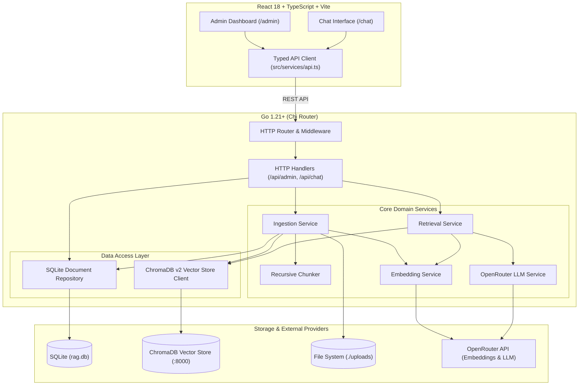
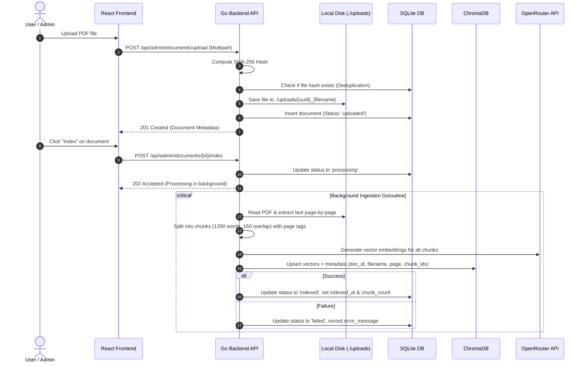
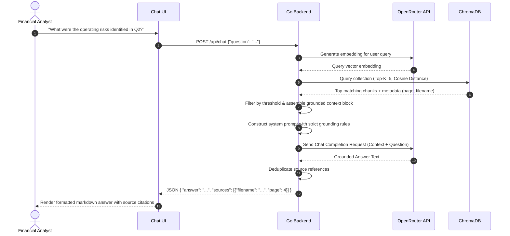

# Supply Chain & Financial Reports RAG System — Comprehensive Project Overview

An autonomous, enterprise-grade Document Intelligence and Retrieval-Augmented Generation (RAG) platform tailored for querying complex financial reports, balance sheets, quarterly 10-K/10-Q filings, and supply chain updates with page-level citation grounding.

---

## 1. Project Context & Objectives

### Problem Statement
Financial statements and supply chain disclosures are dense, multi-page PDFs packed with numerical tables, operational commentary, and regulatory disclosures. Traditional keyword search fails to connect conceptual queries (e.g., *"What were the operating margin headwinds in Q3?"*), while generic LLM querying suffers from:
1. **Hallucination Risk**: Fabricating financial metrics and ratios.
2. **Lack of Verifiability**: Inability to point auditors or analysts to the exact document and page.
3. **Context Window Limits**: Inability to process hundreds of pages of filings at once cost-effectively.

### Solution
This project implements an end-to-end RAG architecture in **Go** and **React / TypeScript**:
- Ingests and extracts text from unstructured PDF documents.
- Chunks and embeds content while preserving document hash and page metadata.
- Stores vector representations in **ChromaDB** and structured lifecycle metadata in **SQLite**.
- Employs a strict system prompt to constrain the LLM exclusively to retrieved context.
- Delivers answers accompanied by deduplicated, clickable source citations (document name + page number).

---

## 2. System Architecture

The application is structured into a clean client-server architecture with dedicated persistence and vector search layers:



---

## 3. Component Breakdown

### 3.1 Backend Architecture (Go)
The Go backend follows a modular, dependency-injected internal package layout:

| Package | Path | Responsibility |
|---|---|---|
| **Entrypoint** | `cmd/server/main.go` | Boots config, database connections, service instantiation, route registration, and graceful HTTP server startup. |
| **Config** | `internal/config/config.go` | Loads environment variables (`.env`) with fallback defaults for chunk sizing, model selection, ports, and thresholds. |
| **Database** | `internal/database/sqlite.go` | Initializes SQLite connection pool, applies auto-migration schema for document records. |
| **Models** | `internal/models/models.go` | Domain models (`Document`, `Chunk`, `SourceCitation`, `ChatRequest`, `ChatResponse`, `AdminStats`). |
| **Repository** | `internal/repositories/document_repository.go` | CRUD interface for document lifecycle states, statistics queries, deduplication lookup by SHA-256 hash. |
| **Vector Store** | `internal/vectorstore/chroma.go` | ChromaDB v2 REST API integration. Handles collection creation, batched vector upserts, and cosine similarity queries. |
| **RAG Chunker** | `internal/rag/chunker.go` | Splits raw text into fixed word chunks (e.g. 1200 words) with configurable overlap (e.g. 150 words) per page. |
| **Services** | `internal/services/` | Business logic orchestrators: `ingestion.go`, `retrieval.go`, `embedding.go`, `llm.go`. |
| **Handlers** | `internal/handlers/` | REST controllers: `admin.go` (upload, list, stats, delete, trigger index) and `chat.go` (query prompt execution). |
| **Utilities** | `internal/utils/` | SHA-256 file hashing (`hash.go`) and page-by-page PDF text extraction (`pdf.go`). |

### 3.2 Frontend Architecture (React / Vite)
A modern single-page application built with React 18, Vite, TypeScript, and Tailwind CSS:

- **Admin Dashboard (`/admin`)**:
  - Live aggregate statistics bar (Total Documents, Indexed Documents, Processed Pages, Total Chunks).
  - Drag-and-drop / file selector for PDF uploads.
  - Interactive table displaying document status (`uploaded`, `processing`, `indexed`, `failed`), timestamps, size, chunk counts, error tooltips, and manual Index/Delete triggers.
- **Chat Interface (`/chat`)**:
  - Conversational message thread with user questions and assistant replies.
  - Streaming/loading states and error banners.
  - Dedicated **Citations Bar** under each assistant message rendering interactive source badges (e.g., `📄 TSLA_Q3_Report.pdf (Page 14)`).
- **Service Layer (`src/services/api.ts`)**:
  - Strongly-typed Fetch wrapper interfacing with `/api/admin/*` and `/api/chat`.

---

## 4. How the System Works (End-to-End Mechanics)

### 4.1 Ingestion Flow (Document to Vector DB)



### 4.2 Query & Grounded Retrieval Flow



### 4.3 Grounding & Anti-Hallucination Prompt Strategy
The retrieval service enforces strict factual grounding using the following prompt template:

```
You are an expert financial and supply chain intelligence assistant.
Answer the user's question accurately using ONLY the context provided below.
If the context does not contain the answer, state clearly that the provided documents
do not contain sufficient information. Do not make assumptions or fabricate facts.

Context:
---
[Document: 10K_2025.pdf | Page: 12]
Operating margin contracted by 120 bps due to supply chain freight rate spikes...
---

Question: What caused operating margin contraction?
Answer:
```

---

## 5. Current Implementation Stage

| Area | Status | Maturity Level | Notes |
|---|---|---|---|
| **Architecture & Structure** | Complete | Production Foundation | Clean hexagonal/service layout in Go, decoupled React UI. |
| **Document Ingestion** | Complete | Working Demo | PDF extraction via `ledongthuc/pdf`, word-based sliding chunker. |
| **Vector DB Integration** | Complete | Working Demo | ChromaDB REST v2 client with batch upserts and metadata tagging. |
| **Metadata Store** | Complete | Stable | SQLite with automated schema migrations and deduplication. |
| **LLM & Embeddings** | Complete | Working Demo | OpenRouter integration (`gpt-4o-mini`, `text-embedding-3-small`). |
| **Admin UI** | Complete | Functional UI | Stats counters, drag-and-drop upload, manual index trigger, deletion. |
| **Chat UI** | Complete | Functional UI | Responsive chat interface with inline clickable page citations. |
| **Build & Type Safety** | Complete | Clean | Zero Go vet warnings, clean TypeScript compilation and Vite bundle. |

---

## 6. Known Limitations & What to Improve (Roadmap)

```mermaid
mindmap
  root((Future Roadmap))
    Document Parsing
      OCR Engine for scanned PDFs (Tesseract / AWS Textract)
      Table extraction & structural preservation
      Multi-format support (.docx, .xlsx, .html)
    RAG & Retrieval Quality
      Hybrid Search (Dense Vector + BM25 Sparse Search)
      Cross-Encoder Reranking (Cohere / BGE-Reranker)
      Semantic & Hierarchical Chunking (Markdown/Section-aware)
      Parent-Child & Summary Indexing
    System Architecture & Scale
      Distributed worker queue (Asynq / Redis) for background tasks
      SSE / WebSocket for real-time indexing progress & token streaming
      Multi-tenancy & Collection isolation per organization
      Authentication & Role-Based Access Control (RBAC)
    Enterprise Observability
      OpenTelemetry & Tracing (Langfuse / Phoenix)
      Grounding evaluation pipeline (RAGAS metrics)
      Comprehensive test suite (Unit & Integration tests)
```

### 1. Document Parsing & Structure Preservation
- **Current**: Sequential plain-text extraction via `ledongthuc/pdf`.
- **Improvement**: 
  - Integrate table-aware extraction tools (e.g., `pdfplumber`, PyMuPDF, or specialized vision models) so financial balance sheets retain column/row relationships.
  - Add OCR fallback for scanned reports.

### 2. Advanced Retrieval & Reranking
- **Current**: Top-K dense vector retrieval via ChromaDB.
- **Improvement**:
  - **Hybrid Search**: Combine dense vector similarity with sparse lexical search (BM25) to catch exact financial tickers, numbers, and part codes.
  - **Two-Stage Reranking**: Use a cross-encoder model to re-score the top 20 candidate chunks down to the most relevant 5 chunks before context assembly.

### 3. Asynchronous Worker Architecture
- **Current**: Ingestions execute in lightweight in-memory Go goroutines.
- **Improvement**:
  - Use a persistent task queue (e.g., Redis + `asynq`) to manage concurrency, backpressure, retries, and rate limits across large batches of filings.

### 4. Streaming & Real-time Feedback
- **Current**: Standard JSON request/response for chat and document indexing.
- **Improvement**:
  - Add Server-Sent Events (SSE) to stream LLM tokens to the Chat UI in real time.
  - Add WebSocket/SSE for real-time progress bars during PDF indexing.

### 5. Multi-Tenancy, Security & RBAC
- **Current**: Single local SQLite database and unified collection.
- **Improvement**:
  - Add JWT authentication, organization-level vector collection isolation, and audit logging for enterprise deployment.

---

## 7. Quick Reference: Configuration & Environment Variables

| Variable | Default Value | Description |
|---|---|---|
| `OPENROUTER_API_KEY` | *(Required)* | OpenRouter API authentication key. |
| `OPENROUTER_MODEL` | `openai/gpt-4o-mini` | LLM model for contextual question answering. |
| `EMBEDDING_PROVIDER` | `chroma` | Embedding backend provider (`chroma` or `openrouter`). |
| `EMBEDDING_MODEL` | `all-MiniLM-L6-v2` | Embedding model identifier. |
| `CHROMA_URL` | `http://localhost:8000` | Target ChromaDB instance endpoint. |
| `DATABASE_PATH` | `./rag.db` | Path to the local SQLite database file. |
| `UPLOAD_DIR` | `./uploads` | Directory where uploaded PDF documents are stored. |
| `CHUNK_SIZE` | `1200` | Number of words per text chunk. |
| `CHUNK_OVERLAP` | `150` | Word overlap between adjacent chunks. |
| `DEFAULT_TOP_K` | `5` | Number of vector search results retrieved per query. |
| `RETRIEVAL_THRESHOLD` | `0.7` | Minimum cosine similarity score required for context inclusion. |
| `SERVER_PORT` | `8080` | Port for the Go backend HTTP server. |
