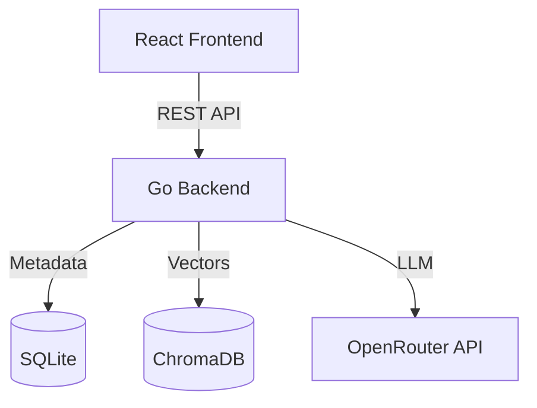

# Architecture Document

## System Architecture

The Supply Chain / Financial Reports RAG System is a demo-grade Document Intelligence System consisting of a Go backend and a React frontend.

## Component Responsibilities

### Backend (Go)
- **`cmd/server`**: Application entry point, config initialization, router setup, and server startup.
- **`internal/config`**: Loads environment variables and provides structured configuration.
- **`internal/database`**: SQLite connection management and schema migrations.
- **`internal/vectorstore`**: Abstraction over ChromaDB client for vector search and indexing.
- **`internal/rag`**: Orchestrates the RAG pipeline (document parsing, chunking, embedding generation).
- **`internal/handlers`**: HTTP request/response handling.
- **`internal/services`**: Business logic.
- **`internal/repositories`**: Data access layer for SQLite.
- **`internal/utils`**: Helper functions (hashing, text extraction).

### Frontend (React)
- **`/admin`**: Dashboard for managing documents, uploading PDFs, and viewing stats.
- **`/chat`**: Interface for querying the knowledge base with grounded citations.

## Data Models

### SQLite (`documents`)
- `id`: TEXT (Primary Key)
- `filename`: TEXT
- `file_hash`: TEXT (Indexed, for dedup)
- `file_size`: INTEGER
- `page_count`: INTEGER
- `status`: TEXT (`uploaded`, `processing`, `indexed`, `failed`)
- `chunk_count`: INTEGER
- `uploaded_at`: DATETIME
- `indexed_at`: DATETIME
- `error_message`: TEXT

### ChromaDB
- **Collection Name**: `rag_documents`
- **Metadata**: 
  - `document_id`: TEXT
  - `filename`: TEXT
  - `page`: INTEGER
  - `chunk_index`: INTEGER
  - `document_hash`: TEXT
- **ID Strategy**: Deterministic ID based on `hash + page + chunk_index`.

## RAG Flow
### Ingestion Flow
1. Receive PDF -> Validate -> Hash -> Check Dedup.
2. Store PDF to disk.
3. Extract text page-by-page.
4. Apply recursive chunking (maintaining page associations).
5. Generate embeddings.
6. Insert vectors + metadata into ChromaDB.
7. Update SQLite status to `indexed`.

### Query Flow
1. Receive query text.
2. Embed query.
3. Perform similarity search in ChromaDB (top-K).
4. Filter and construct context string.
5. Create system prompt enforcing strict grounding rules.
6. Send prompt to OpenRouter.
7. Return answer and extract deduplicated citations from ChromaDB metadata.
